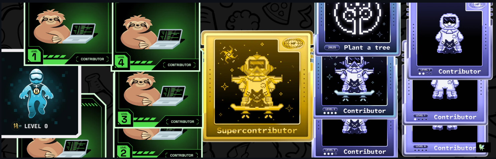

<div align="center">

# Hey there, I'm Aman Yadav 👋

### Full-Stack Developer · Open Source Contributor · Systems Thinker

[](https://git.io/typing-svg)

<p>
  
  
</p>

</div>

---

## 🧑‍💻 About Me

```yaml
name: Aman Yadav
role: Full-Stack Developer
location: India 🇮🇳
focus:
  - Scalable backend systems with Node.js & Spring Boot
  - Modern frontend experiences with React
  - Cloud-native apps on AWS with Docker & Kubernetes
  - Open Source contributions
currently_learning: [System Design, Microservices, DevOps pipelines]
ask_me_about: [MERN Stack, Java, REST APIs, DSA]
motto: "Code. Learn. Build. Repeat."
```

---

## 🔗 Connect With Me

<p align="center">
  <a href="https://www.linkedin.com/in/aman-yadav-239030299/" target="_blank">
    
  </a>
  <a href="https://x.com/Yadavaman03" target="_blank">
    
  </a>
  <a href="https://leetcode.com/u/Amanyadav03/" target="_blank">
    
  </a>
  <a href="https://www.codechef.com/users/amanyadav03" target="_blank">
    
  </a>
</p>

---

## 🏅 Holopin Badges

<!-- <p align="center">
  <a href="https://holopin.me/@amanyadav0315">
    
  </a>
</p>

<p align="center">
  <a href="https://holopin.me/@amanyadav0315">
    
  </a>
</p> -->



---


## 🛠️ Tech Stack

<div align="center">

**Languages**

<a href="https://skillicons.dev">
  
</a>

**Frameworks & Libraries**

<a href="https://skillicons.dev">
  
</a>

**Databases & Cloud / DevOps**

<a href="https://skillicons.dev">
  
</a>

</div>

---

## 📊 GitHub Stats

<p align="center">
  
  &nbsp;
  
</p>

<p align="center">
  
</p>

---

## 📈 Contribution Graph

<p align="center">
  
</p>

---

<div align="center">

### 💡 *"Code. Learn. Build. Repeat."*

**Open to collaboration, open source contributions, and exciting opportunities.**
**Let's build something impactful together! 🚀**

</div>
